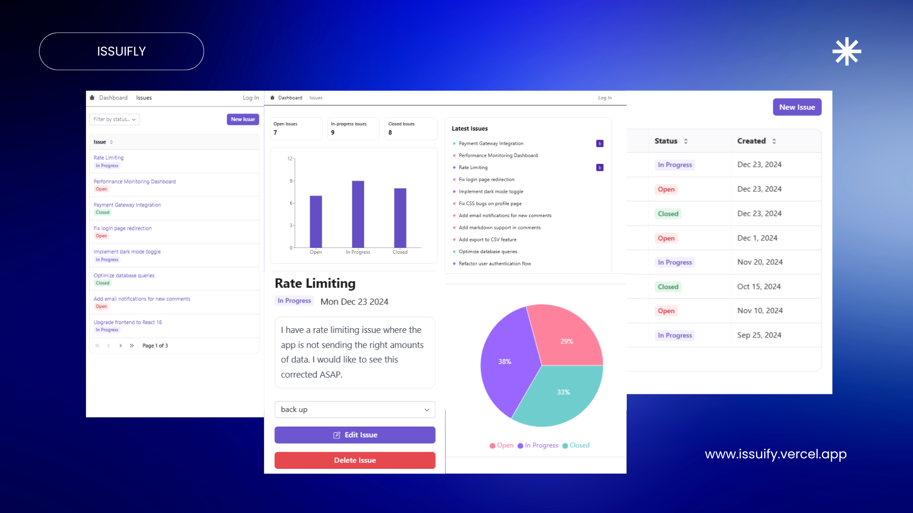
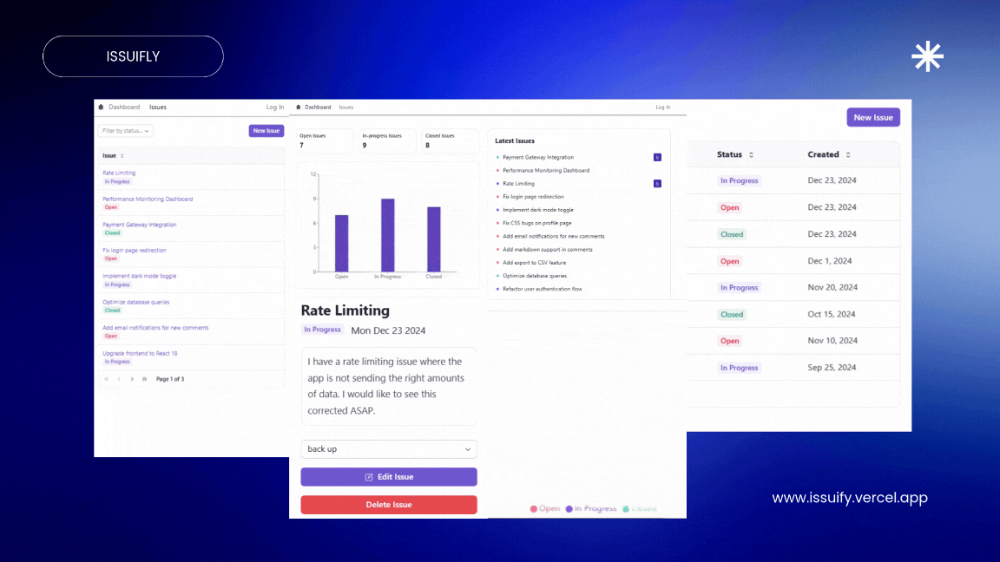

<h1 align="center">Issuify</h1>
<p align="center">
A sleek and simple issue tracker for your project.
</p>
<!-- <p align="center">
A sleek and simple issue tracker for your project.
</p> -->

<div align="center">
  
</div> 
<!--  <div align="center">
  
</div>-->

<p align="center">
  <a href="https://issuefy.vercel.app/">issuefy.vercel.app</a>
</p>

<p align="center">
  A modern, intuitive issue tracking system built with Next.js 15, designed to streamline project management and boost team productivity.
</p>
<br>

## ✨ Features

- **Clean, Modern UI**: Minimalist design with smooth animations
- **Real-time Issue Management**: Efficiently track and manage project issues
- **Interactive Dashboard**: Visual analytics and issue statistics
- **Secure Authentication**: Google authentication integration
- **Responsive Design**: Seamless experience across all devices
  <br>

## 🛠️ Tech Stack

- **Frontend**:

  - [Next.js 15](https://nextjs.org/) (App Router)
  - [React](https://reactjs.org/)
  - [React Query](https://tanstack.com/query/latest) (Data fetching)
  - [Radix UI](https://www.radix-ui.com/) (UI components)
  - [React SimpleMDE](https://github.com/RIP21/react-simplemde-editor) (Markdown editor)

- **Backend**:

  - [Next.js API Routes](https://nextjs.org/docs/api-routes/introduction)
  - [Prisma ORM](https://www.prisma.io/)
  - [Zod](https://zod.dev/) (Schema validation)

- **Database**:

  - [PostgreSQL](https://www.postgresql.org/) (NeonDB)

- **Authentication**:

  - [NextAuth.js](https://next-auth.js.org/)
  - Google OAuth

- **Styling**:

  - [Tailwind CSS](https://tailwindcss.com/)

- **Development Tools**:
  - [React Hook Form](https://react-hook-form.com/) (Form validation)
  - [React Hot Toast](https://react-hot-toast.com/) (Notifications)
  - [React Skeleton](https://www.npmjs.com/package/react-loading-skeleton) (Loading states)
  - [Axios](https://axios-http.com/) (HTTP client)
    <br>

## 🚀 Getting Started

1. **Clone the repository**

```bash
git clone https://github.com/mahendrakale4/issue-tracker.git
cd issue-tracker
```

2. **Install dependencies**

```bash
npm install
```

3. **Set up environment variables**
   Create a `.env` file in the root directory:

```env
DATABASE_URL=
NEXTAUTH_URL=
NEXTAUTH_SECRET=
GOOGLE_CLIENT_ID=
GOOGLE_CLIENT_SECRET=
```

4. **Run the development server**

```bash
npm run dev
```

Open [http://localhost:3000](http://localhost:3000) with your browser to see the result.

## 📱 Core Features

- **Issue Management**

  - Create and track issues
  - Assign priorities and status
  - Filter and search functionality
  - Real-time updates

- **Dashboard**

  - Issue statistics
  - Progress tracking
  - Visual data representation

- **User Features**
  - Google authentication
  - User profiles
  - Role-based access
    <br>

## 🤝 Contributing

Contributions are welcome! Feel free to:

- Report bugs
- Suggest new features
- Submit pull requests
